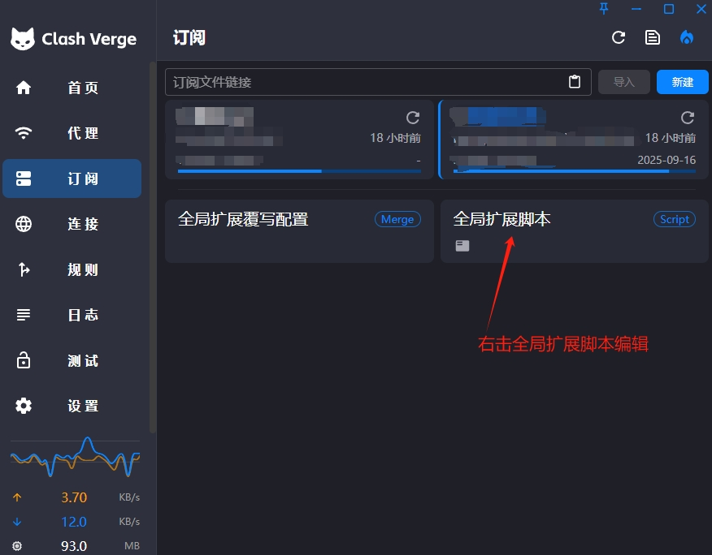
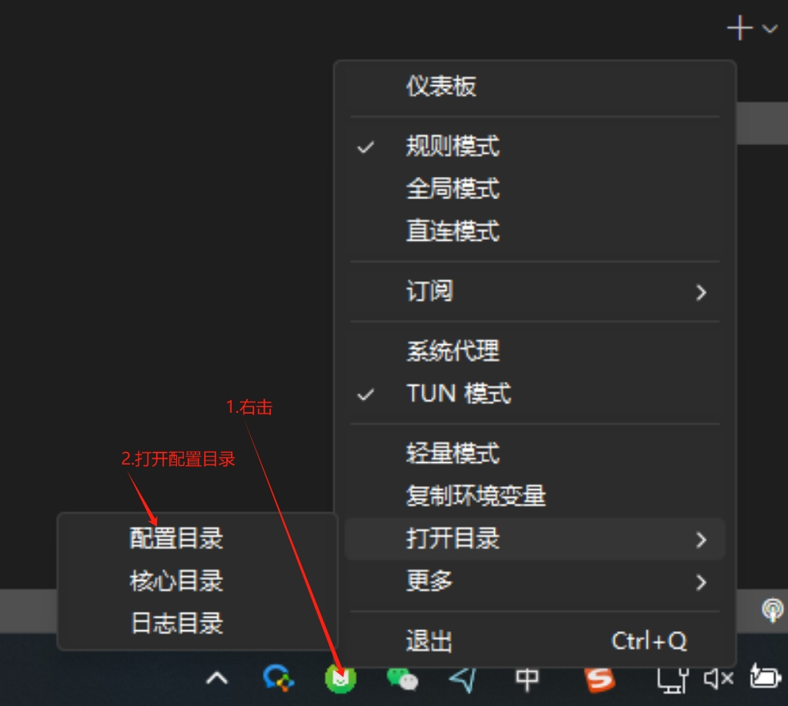
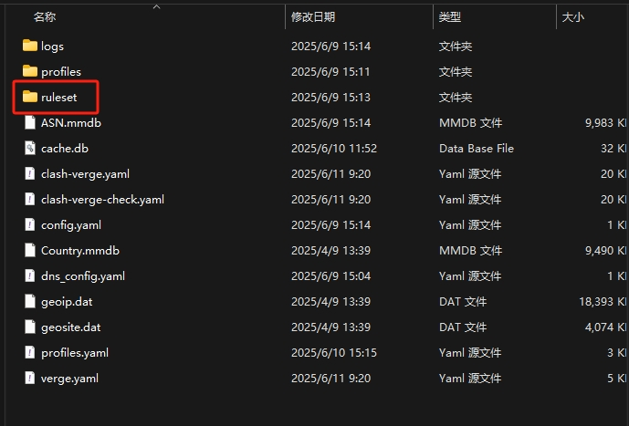
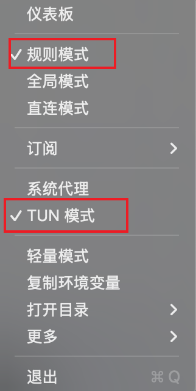

# clash客户端分流规则配置—让你的clash更简单好用！
## clash-verge-rev[下载](https://github.com/clash-verge-rev/clash-verge-rev/releases)

# 说明
## 项目目录中有两个配置文件，分别是script_http（线上分流规则集）和script_local(本地分流规则集，需要下载到本地使用)，建议先试用线上分流规则集，熟练后再使用本地分流规则集自定义属于自己的规则集

# config
## 打开客户端->点击订阅->右击全局扩展脚本->编辑文件->将项目中的script_xxx文件内容复制到编辑框中，然后点击保存即可
## 若使用script_http则不需要任何操作即可开启你的分流之旅

## 若使用script_local将项目中的ruleset目录及所有文件复制到配置目录

# 使用
## 点击代理->规则->找到对应分组，选择对应规则即可（目前有AI、Github、Telegram、流媒体、国外五个规则集）记得国内选DIRECT

## 最后右键clash图标打开规则规则模式和TUN模式即可

## script_xxx.js有关键配置注释，可以根据自己的需求自行修改

# 如有问题联系wx: 740411080（备注：clash）

# 如果没有好用的机场可以尝试一下（[流量光](https://llgjc1.com/#/register?code=ZC9Klt1L)）还不错，20元1年，每月60G流量，链接需番茄上网才能打开